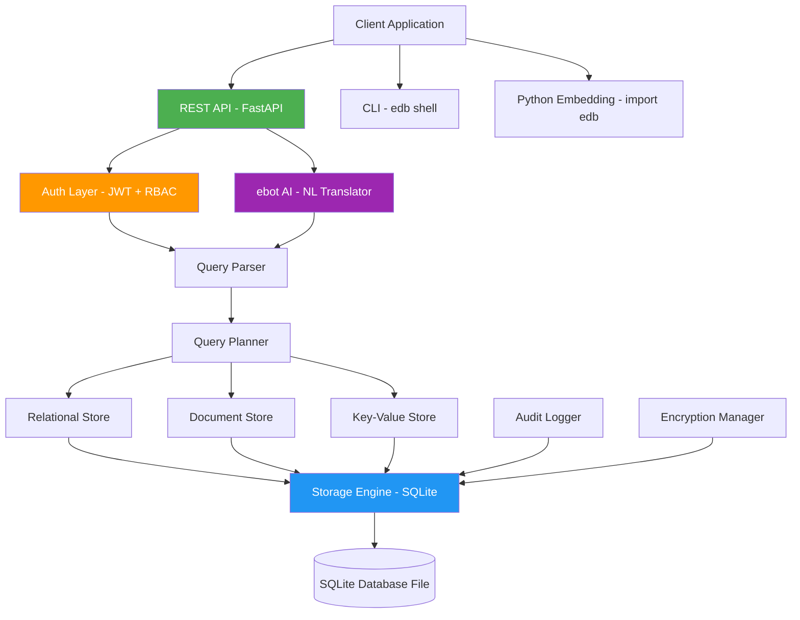

# eDB Architecture

## System Overview

## Components

### Storage Engine (`edb.core.engine`)
The lowest-level component. Manages the SQLite connection with WAL mode, thread safety, and parameterized query execution.

### Relational Store (`edb.core.relational`)
SQL CRUD operations (CREATE TABLE, INSERT, SELECT, UPDATE, DELETE) with parameterized queries to prevent injection.

### Document Store (`edb.core.document`)
MongoDB-like JSON document storage. Collections are SQLite tables with `id`, `data` (JSON), `created_at`, `updated_at`. Supports JSON path queries via SQLite's JSON1 extension.

### Key-Value Store (`edb.core.keyvalue`)
Simple key-value operations with optional TTL expiration. Values are JSON-serialized. Expired entries are automatically purged.

### Unified Database (`edb.core.database`)
Single entry point combining all three stores. Provides transaction support via context manager (`with db.transaction()`).

### Query Parser (`edb.query.parser`)
Parses JSON-based query DSL into typed query objects. Validates actions, required fields, and type aliases.

### Query Planner (`edb.query.planner`)
Routes parsed queries to the correct store and executes them. Returns unified results regardless of underlying store type.

### Authentication (`edb.auth`)
- **JWT Handler**: Creates and verifies access/refresh tokens
- **User Manager**: User CRUD with bcrypt password hashing
- **RBAC Manager**: Role-based permission checks (admin, read_write, read_only, custom roles)

### Security (`edb.security`)
- **Encryption**: AES-256-GCM field-level encryption at rest
- **Audit Logger**: Tamper-resistant append-only log with hash chain verification
- **Input Validator**: SQL injection, NoSQL injection, and prompt injection detection

### ebot (`edb.ebot`)
- **Translator**: Natural language → eDB query DSL (rule-based regex patterns)
- **Sanitizer**: Validates translations, enforces RBAC on AI-generated queries

### REST API (`edb.api`)
FastAPI application with routes for SQL, Documents, KV, Auth, Admin, and ebot. All endpoints require JWT authentication and RBAC permission checks.

## Data Flow

1. **Request** → FastAPI endpoint
2. **Auth** → JWT verification → RBAC check
3. **Validation** → Input sanitization
4. **Execution** → Query parser → Planner → Appropriate store
5. **Audit** → Log the operation with hash chain
6. **Response** → Unified result format
