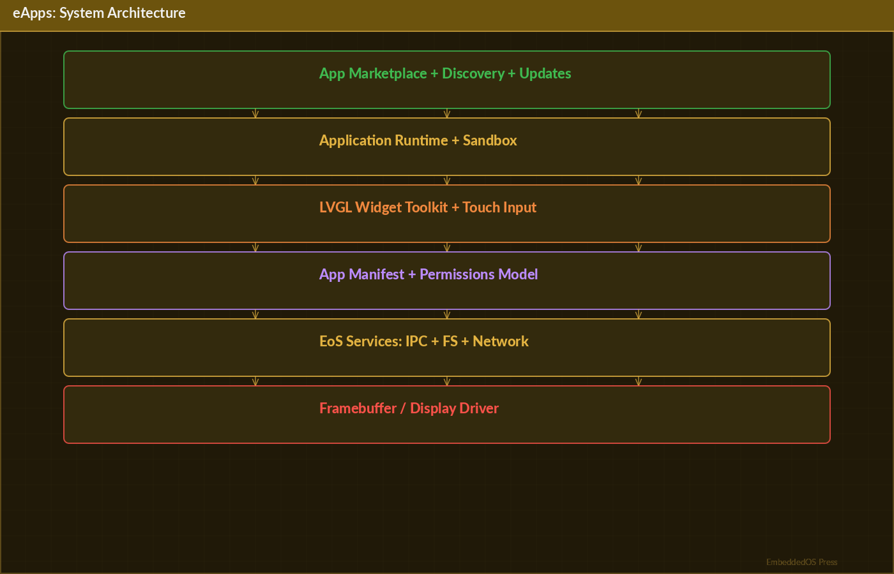

---

# eApps — EoS Unified Marketplace & App Store

## The Definitive Technical Reference




**Version 1.0**

**Srikanth Patchava & EmbeddedOS Contributors**

**April 2026**

---

*Published as part of the EmbeddedOS Product Reference Series*

*Apache License 2.0 — Copyright (c) 2026 EmbeddedOS Organization*

---

# Preface

eApps is the unified marketplace, monorepo, and automated app store for the entire EoS (Embedded Operating System) ecosystem. It represents the convergence of native embedded applications, desktop software, mobile apps, web progressive web apps, browser extensions, developer tools, CLI utilities, and enterprise deployments into a single repository with fully automated CI/CD pipelines.

This reference book is intended for application developers, platform engineers, DevOps professionals, and product managers who need to build, package, distribute, and maintain applications across the diverse EoS ecosystem. Whether you are developing a native LVGL [@lvgl_docs] embedded application, packaging a Flutter [@flutter] mobile app, creating a VS Code extension, or deploying a Docker-based enterprise solution, this book provides comprehensive technical coverage.

eApps manages **50 applications across 8 platform categories**, producing **188 platform targets** through 7 CI/CD workflows. The marketplace is served as a static website on GitHub Pages, with `data/apps.json` as the single source of truth for all application listings, versions, and download links.

The monorepo architecture enables shared code across platforms — a fix in the `shared/` directory benefits all platforms automatically. Code signing, auto-update manifests, and supply chain security are built into every workflow.

— *Srikanth Patchava & EmbeddedOS Contributors, April 2026*

---

# Table of Contents

1. [Introduction](#chapter-1-introduction)
2. [Getting Started](#chapter-2-getting-started)
3. [System Architecture](#chapter-3-system-architecture)
4. [Marketplace & App Store](#chapter-4-marketplace--app-store)
5. [Native Applications](#chapter-5-native-applications)
6. [Desktop Applications](#chapter-6-desktop-applications)
7. [Mobile Applications](#chapter-7-mobile-applications)
8. [Web Applications](#chapter-8-web-applications)
9. [Browser Extensions](#chapter-9-browser-extensions)
10. [Developer Tools](#chapter-10-developer-tools)
11. [CLI Tools](#chapter-11-cli-tools)
12. [Enterprise Deployments](#chapter-12-enterprise-deployments)
13. [App Lifecycle Management](#chapter-13-app-lifecycle-management)
14. [CI/CD Pipeline](#chapter-14-cicd-pipeline)
15. [Code Signing & Security](#chapter-15-code-signing--security)
16. [Shared Code Library](#chapter-16-shared-code-library)
17. [Installer Generation](#chapter-17-installer-generation)
18. [Cross-Platform Deployment](#chapter-18-cross-platform-deployment)
19. [Configuration Reference](#chapter-19-configuration-reference)
20. [Testing](#chapter-20-testing)
21. [Troubleshooting](#chapter-21-troubleshooting)
22. [Glossary](#chapter-22-glossary)

---

# Chapter 1: Introduction

## 1.1 What is eApps?

eApps is the unified marketplace, monorepo, and automated app store for the EoS ecosystem. It is a single repository that contains every EoS application across all platforms, with automated build, test, package, sign, and deploy pipelines.

**One repository. Every EoS app. All platforms. Automated delivery.**

## 1.2 Key Capabilities

| Capability | Description |
|---|---|
| 50 applications | Native, desktop, mobile, web, extensions, dev tools, CLI, enterprise |
| 8 platform categories | Covering every deployment target from MCU to cloud |
| 188 platform targets | Each app built for multiple platforms |
| Automated CI/CD | 7 workflows: build, test, package, sign, release, update catalog, deploy |
| Live app store | GitHub Pages marketplace with search, filter, and download |
| Shared code | Cross-platform shared libraries in JS, Dart, C, and Python |
| Code signing | EV certificates, Apple signing, Android keystore, Docker trust |
| Auto-updates | Chrome XML and Firefox JSON auto-update manifests |

## 1.3 Platform Categories

| Category | Folder | Count | Technologies | Artifacts |
|---|---|---|---|---|
| **Native Apps** | `apps/` | 46 | C + LVGL (CMake) | Binaries, WASM |
| **Desktop Apps** | `desktop-apps/` | 1 | Electron, Python, C/SDL2 | `.exe` `.dmg` `.AppImage` `.deb` `.eapp` |
| **Mobile Apps** | `mobile-apps/` | 32 | Flutter (Android + iOS) | `.apk` `.aab` `.ipa` |
| **Web Apps** | `web-apps/` | 34 | HTML5/JS/WASM PWA | GitHub Pages PWA |
| **Browser Extensions** | `browser-extensions/` | 20 | WebExtensions Manifest V3 | `.zip` `.crx` `.xpi` |
| **Dev Tools** | `dev-tools/` | 14 | VS Code TS, JetBrains Kotlin, Vim | `.vsix` `.jar` |
| **CLI Tools** | `cli-tools/` | 22 | Node.js, Python | npm, pip, Homebrew |
| **Enterprise** | `enterprise/` | 16 | Docker, Helm, MSI, MDM | Docker images, Helm charts, `.msi` |

## 1.4 Design Philosophy

1. **Single source of truth** — All applications, all platforms, one repository. `data/apps.json` is the authoritative catalog.

2. **Automated everything** — From code commit to store update, every step is automated via GitHub Actions.

3. **Shared code** — Platform-independent code lives in `shared/` and benefits all targets simultaneously.

4. **Security by default** — Code signing, input sanitization, supply chain verification, and secret management are built in.

5. **Progressive enhancement** — Applications start as native LVGL embedded apps and are progressively enhanced for desktop, mobile, and web.

---

# Chapter 2: Getting Started

## 2.1 Prerequisites

- **Git**: For cloning the repository
- **CMake**: For native C/LVGL applications
- **Node.js**: For web apps, extensions, and CLI tools
- **Python**: For EoStudio, EoSim, and Python CLI tools
- **Flutter**: For mobile applications
- **Docker**: For enterprise deployments (optional)

## 2.2 Cloning the Repository

```bash
git clone --recursive https://github.com/embeddedos-org/eApps.git
cd eApps
```

## 2.3 Browse the App Store

Visit **[embeddedos-org.github.io/eApps](https://embeddedos-org.github.io/eApps/)** to browse, filter, search, and download applications for any platform.

## 2.4 Quick Install

```bash
# Chrome extension
# Download .zip from Releases → chrome://extensions → Load unpacked

# VS Code extension
code --install-extension eoffice-vscode-1.0.0.vsix

# Android app
adb install eride-1.0.0.apk

# Desktop app (Linux)
chmod +x EoStudio.AppImage && ./EoStudio.AppImage

# Docker (EoSim)
docker run -it embeddedos/eosim
```

## 2.5 Build from Source

### Native Apps (C/LVGL)

```bash
cmake -B build && cmake --build build && cd build && ctest
```

### Desktop (Electron)

```bash
cd desktop-apps/eoffice && npm install && npm start
```

### Desktop (Python)

```bash
cd desktop-apps/eostudio && pip install -e . && python -m eostudio
```

### Mobile (Flutter)

```bash
cd mobile-apps/eserviceapps && flutter pub get && flutter run
```

### App Store (Local)

```bash
npx serve .
# or
python -m http.server 8000
```

---

# Chapter 3: System Architecture

## 3.1 Repository Structure

```
eApps/
├── index.html                      # App Store website (GitHub Pages)
├── css/marketplace.css             # Store frontend styles
├── js/marketplace.js               # Dynamic app grid from apps.json
├── data/apps.json                  # Single source of truth for all listings
├── updates/                        # Auto-update manifests (Chrome XML, Firefox JSON)
│
├── extensions/                     # Browser & editor extensions
│   ├── browser/                    #   Chrome / Firefox / Safari
│   ├── vscode/                     #   VS Code extension
│   ├── jetbrains/                  #   JetBrains plugin
│   ├── obsidian/                   #   Obsidian plugin
│   ├── slack/                      #   Slack app
│   ├── raycast/                    #   Raycast extension
│   ├── github/                     #   GitHub App
│   ├── google-workspace/           #   Google Workspace add-on
│   └── office365/                  #   Office 365 add-in
│
├── desktop-apps/                   # Desktop applications
│   ├── eoffice/                    #   Electron app
│   ├── eostudio/                   #   Python/Tkinter design IDE
│   ├── eosim/                      #   Python/QEMU simulator
│   └── ebrowser/                   #   C/SDL2 browser engine
│
├── mobile-apps/                    # 32 Flutter mobile apps
├── web-apps/                       # 34 PWA web apps
├── browser-extensions/             # 20 browser extensions (Manifest V3)
├── dev-tools/                      # 14 IDE extensions
├── cli-tools/                      # 22 CLI tools
├── enterprise/                     # 16 enterprise deployments
├── shared/                         # Reusable code (JS, Flutter, C, Python)
│
├── apps/                           # 46 native LVGL apps
├── core/                           # Core C libraries
├── cmake/                          # CMake build helpers
├── tests/                          # Merge validation tests
└── docs/                           # Documentation
```

## 3.2 Marketplace Architecture

```
┌─────────────────────────────────────────────┐
│   https://embeddedos-org.github.io/eApps/   │
│       GitHub Pages — App Store Frontend      │
│   Browse · Filter · Search · Download All    │
└──────────────────┬──────────────────────────┘
                   │ reads
                   ▼
┌─────────────────────────────────────────────┐
│           data/apps.json                     │
│   Central catalog — auto-updated by CI/CD    │
└──────────────────┬──────────────────────────┘
                   │ links to
                   ▼
┌─────────────────────────────────────────────┐
│         GitHub Releases (per app)            │
│  .zip .crx .xpi .vsix .exe .dmg .AppImage   │
│  .apk .aab .ipa — versioned artifacts       │
└─────────────────────────────────────────────┘
```

## 3.3 Data Flow

```
Developer pushes code / creates tag
        │
        ▼
GitHub Actions (7 workflows)
        │
        ├── Build & Test
        ├── Package artifacts (.exe, .dmg, .apk, .zip, .vsix, etc.)
        ├── Sign (code signing via secrets)
        ├── Create GitHub Release with artifacts
        ├── Auto-update data/apps.json with new version
        ├── Update auto-update manifests (Chrome XML, Firefox JSON)
        └── Redeploy App Store to GitHub Pages
```

---

# Chapter 4: Marketplace & App Store

## 4.1 Overview

The eApps marketplace is a static website hosted on GitHub Pages that provides a searchable, filterable catalog of all EoS applications.

## 4.2 App Store Features

- **Search** — Full-text search across app names, descriptions, and tags
- **Filter** — Filter by category, platform, technology
- **Download** — Direct links to GitHub Release artifacts
- **Version tracking** — Current and historical versions
- **Responsive** — Mobile-friendly interface

## 4.3 apps.json Schema

The `data/apps.json` file is the single source of truth:

```json
{
    "apps": [
        {
            "id": "ecalculator",
            "name": "eCalculator",
            "description": "Scientific calculator for EoS",
            "category": "native",
            "technologies": ["C", "LVGL"],
            "platforms": ["eos", "linux", "windows", "wasm"],
            "version": "1.2.0",
            "download_url": "https://github.com/embeddedos-org/eApps/releases/tag/ecalculator-v1.2.0",
            "icon": "assets/icons/ecalculator.png",
            "tags": ["calculator", "math", "utility"],
            "size_kb": 256,
            "updated": "2026-04-20"
        }
    ],
    "metadata": {
        "total_apps": 50,
        "last_updated": "2026-04-25T10:00:00Z",
        "version": "2.0"
    }
}
```

## 4.4 App Store Frontend

The frontend is built with vanilla HTML/CSS/JavaScript:

- `index.html` — Main page with app grid
- `css/marketplace.css` — Responsive styles
- `js/marketplace.js` — Dynamic rendering from `apps.json`

```javascript
// marketplace.js (simplified)
async function loadApps() {
    const response = await fetch('data/apps.json');
    const data = await response.json();
    renderAppGrid(data.apps);
}

function renderAppGrid(apps) {
    const grid = document.getElementById('app-grid');
    apps.forEach(app => {
        const card = createAppCard(app);
        grid.appendChild(card);
    });
}

function filterApps(category) {
    const filtered = allApps.filter(app => app.category === category);
    renderAppGrid(filtered);
}
```

## 4.5 Platform-Specific Installation

| Platform | File Format | How Users Install |
|---|---|---|
| **Chrome** | `.zip` / `.crx` | `chrome://extensions/` → "Load unpacked" |
| **Firefox** | `.xpi` | `about:addons` → "Install from File" |
| **Safari** | `.zip` | Safari Preferences → Enable |
| **VS Code** | `.vsix` | `code --install-extension file.vsix` |
| **JetBrains** | `.jar` / `.zip` | IDE Settings → Install from disk |
| **Android** | `.apk` / `.aab` | Download APK → Install |
| **iOS** | `.ipa` | TestFlight → Install |
| **Windows** | `.exe` | Download → Run installer |
| **macOS** | `.dmg` | Download → Drag to Applications |
| **Linux** | `.AppImage` / `.deb` | `chmod +x app.AppImage && ./app.AppImage` |
| **Docker** | Docker image | `docker run embeddedos/app` |

---

# Chapter 5: Native Applications

## 5.1 Overview

The `apps/` directory contains 46 native applications built with C and LVGL (Light and Versatile Graphics Library). These are the original EoS applications designed for embedded touchscreen devices.

## 5.2 Application List

The native app catalog spans utilities, productivity, media, communication, and system tools:

| Category | Examples |
|---|---|
| Utilities | Calculator, Clock, Calendar, Weather, Unit Converter |
| Productivity | Notes, Todo, File Manager, Text Editor |
| Media | Music Player, Video Player, Image Viewer, Camera |
| Communication | Messaging, Email, Contacts, Phone |
| System | Settings, Terminal, System Monitor, Package Manager |
| Games | Chess, Sudoku, Snake, Tetris |

## 5.3 Native App Architecture

Each native app follows a standard structure:

```
apps/ecalculator/
├── CMakeLists.txt          # Build configuration
├── src/
│   ├── main.c              # App entry point
│   ├── ui.c                # LVGL UI layout
│   ├── logic.c             # Business logic
│   └── resources.c         # Icons, fonts, strings
├── include/
│   └── ecalculator.h       # Public header
├── assets/
│   ├── icon.png            # App icon
│   └── splash.png          # Splash screen
└── tests/
    └── test_calculator.c   # Unit tests
```

## 5.4 Building Native Apps

```bash
# Build all native apps
cmake -B build
cmake --build build

# Run tests
cd build && ctest --output-on-failure

# Build specific app
cmake -B build -DBUILD_APP=ecalculator
cmake --build build

# Build for WASM
cmake -B build-wasm \
  -DCMAKE_TOOLCHAIN_FILE=$EMSDK/cmake/Modules/Platform/Emscripten.cmake
cmake --build build-wasm
```

## 5.5 LVGL Integration

Native apps use LVGL for cross-platform graphics:

```c
#include "lvgl/lvgl.h"

void ecalculator_ui_create(lv_obj_t *parent) {
    // Create display grid
    lv_obj_t *display = lv_label_create(parent);
    lv_label_set_text(display, "0");
    lv_obj_set_size(display, LV_PCT(100), 80);

    // Create button matrix
    static const char *btnm_map[] = {
        "7", "8", "9", "/", "\n",
        "4", "5", "6", "*", "\n",
        "1", "2", "3", "-", "\n",
        "C", "0", "=", "+", "",
    };

    lv_obj_t *btnm = lv_btnmatrix_create(parent);
    lv_btnmatrix_set_map(btnm, btnm_map);
    lv_obj_add_event_cb(btnm, calc_event_handler, LV_EVENT_VALUE_CHANGED, display);
}
```

## 5.6 Cross-Platform CMake

The CMake build system supports multiple targets:

```cmake
cmake_minimum_required(VERSION 3.16)
project(ecalculator C)

# LVGL
add_subdirectory(../../core/lvgl lvgl)

# App sources
add_executable(ecalculator
    src/main.c
    src/ui.c
    src/logic.c
)

target_link_libraries(ecalculator PRIVATE lvgl)
target_include_directories(ecalculator PRIVATE include)

# Tests
if(BUILD_TESTING)
    add_executable(test_calculator tests/test_calculator.c src/logic.c)
    add_test(NAME calculator COMMAND test_calculator)
endif()
```

---

# Chapter 6: Desktop Applications

## 6.1 Overview

The `desktop-apps/` directory contains desktop applications packaged for Windows, macOS, and Linux.

## 6.2 Desktop Apps

| App | Technology | Description |
|---|---|---|
| eOffice | Electron | Office suite with 12 apps + web apps |
| EoStudio | Python/Tkinter | Visual design IDE with 12 editors |
| EoSim | Python/QEMU | Hardware simulator (52+ platforms) |
| eBrowser | C/SDL2 | Browser engine with rendering |

## 6.3 eOffice (Electron)

```bash
cd desktop-apps/eoffice
npm install
npm start          # Development
npm run build      # Production build
npm run package    # Create installers
```

### Installer Artifacts

| Platform | Format | Tool |
|---|---|---|
| Windows | `.exe` (NSIS) | electron-builder |
| macOS | `.dmg` | electron-builder |
| Linux | `.AppImage`, `.deb` | electron-builder |

## 6.4 EoStudio (Python)

```bash
cd desktop-apps/eostudio
pip install -e .
python -m eostudio
```

## 6.5 EoSim (Python + QEMU)

```bash
cd desktop-apps/eosim
pip install -e .
python -m eosim
```

## 6.6 eBrowser (C/SDL2)

```bash
cd desktop-apps/ebrowser
cmake -B build
cmake --build build
./build/ebrowser
```

---

# Chapter 7: Mobile Applications

## 7.1 Overview

The `mobile-apps/` directory contains 32 Flutter mobile applications targeting Android and iOS.

## 7.2 Building Mobile Apps

```bash
cd mobile-apps/eserviceapps
flutter pub get
flutter run                    # Debug on connected device
flutter build apk             # Android APK
flutter build appbundle        # Android App Bundle
flutter build ios              # iOS (requires macOS + Xcode)
```

## 7.3 Mobile App Architecture

Each Flutter app follows standard Flutter architecture:

```
mobile-apps/eride/
├── lib/
│   ├── main.dart              # App entry point
│   ├── screens/               # UI screens
│   ├── models/                # Data models
│   ├── services/              # API services
│   ├── widgets/               # Reusable widgets
│   └── providers/             # State management
├── android/                   # Android-specific
├── ios/                       # iOS-specific
├── test/                      # Unit tests
├── pubspec.yaml               # Dependencies
└── README.md
```

## 7.4 Shared Flutter Code

Common Flutter code is in `shared/flutter/`:

```dart
// shared/flutter/lib/eos_theme.dart
import 'package:flutter/material.dart';

class EoSTheme {
    static ThemeData get light => ThemeData(
        primarySwatch: Colors.blue,
        fontFamily: 'Inter',
    );

    static ThemeData get dark => ThemeData.dark().copyWith(
        primaryColor: Colors.blue,
    );
}
```

---

# Chapter 8: Web Applications

## 8.1 Overview

The `web-apps/` directory contains 34 Progressive Web Apps (PWAs) built with HTML5, JavaScript, and WebAssembly.

## 8.2 PWA Architecture

```
web-apps/ecalculator-web/
├── index.html                 # App shell
├── manifest.json              # PWA manifest
├── service-worker.js          # Offline support
├── css/
│   └── app.css                # Styles
├── js/
│   └── app.js                 # Application logic
└── assets/
    └── icons/                 # App icons (multiple sizes)
```

## 8.3 PWA Features

| Feature | Description |
|---|---|
| Offline support | Service worker caching for offline use |
| Installable | "Add to Home Screen" support |
| Responsive | Mobile-first responsive design |
| WASM | WebAssembly modules for native-speed computation |

## 8.4 WASM Integration

Native C apps can be compiled to WebAssembly for web deployment:

```bash
# Build WASM from native app
emcc apps/ecalculator/src/logic.c \
  -o web-apps/ecalculator-web/js/calculator.wasm \
  -s EXPORTED_FUNCTIONS='["_calculate"]' \
  -s MODULARIZE=1
```

```javascript
// Load WASM module
const calculator = await Module();
const result = calculator._calculate(operand1, operator, operand2);
```

---

# Chapter 9: Browser Extensions

## 9.1 Overview

The `browser-extensions/` directory contains 20 browser extensions built with WebExtensions Manifest V3.

## 9.2 Extension Architecture

```
browser-extensions/eos-tools/
├── manifest.json              # Extension manifest (V3)
├── background.js              # Service worker
├── content.js                 # Content script
├── popup/
│   ├── popup.html             # Popup UI
│   ├── popup.css              # Popup styles
│   └── popup.js               # Popup logic
├── options/
│   ├── options.html           # Settings page
│   └── options.js             # Settings logic
└── icons/
    ├── icon-16.png
    ├── icon-48.png
    └── icon-128.png
```

## 9.3 Manifest V3

```json
{
    "manifest_version": 3,
    "name": "EoS Tools",
    "version": "1.0.0",
    "description": "EoS development tools for the browser",
    "permissions": ["storage", "activeTab"],
    "background": {
        "service_worker": "background.js"
    },
    "action": {
        "default_popup": "popup/popup.html",
        "default_icon": "icons/icon-48.png"
    },
    "content_scripts": [{
        "matches": ["<all_urls>"],
        "js": ["content.js"]
    }]
}
```

## 9.4 Cross-Browser Support

| Browser | Format | Auto-Update |
|---|---|---|
| Chrome | `.zip` / `.crx` | Chrome XML manifest |
| Firefox | `.xpi` | Firefox JSON manifest |
| Safari | `.zip` | Manual update |
| Edge | `.zip` (Chrome compatible) | Chrome XML manifest |

---

# Chapter 10: Developer Tools

## 10.1 Overview

The `dev-tools/` directory contains 14 IDE extensions for VS Code, JetBrains IDEs, and Vim.

## 10.2 VS Code Extensions

```
dev-tools/vscode-eos/
├── package.json               # Extension manifest
├── src/
│   ├── extension.ts           # Entry point
│   ├── commands.ts            # Command implementations
│   ├── providers/             # Language features
│   └── views/                 # Custom panels
├── syntaxes/                  # TextMate grammars
└── tsconfig.json
```

### Building VS Code Extensions

```bash
cd dev-tools/vscode-eos
npm install
npm run compile
npm run package     # Creates .vsix
```

## 10.3 JetBrains Plugins

```bash
cd dev-tools/jetbrains-eos
./gradlew buildPlugin    # Creates .jar / .zip
```

---

# Chapter 11: CLI Tools

## 11.1 Overview

The `cli-tools/` directory contains 22 command-line tools built with Node.js and Python.

## 11.2 Node.js CLI Tools

```bash
cd cli-tools/eos-cli
npm install
npm link    # Install globally
eos-cli --help
```

## 11.3 Python CLI Tools

```bash
cd cli-tools/eos-deploy
pip install -e .
eos-deploy --help
```

## 11.4 Distribution

| Package Manager | Install Command |
|---|---|
| npm | `npm install -g @embeddedos/eos-cli` |
| pip | `pip install eos-deploy` |
| Homebrew | `brew install embeddedos/tap/eos-cli` |

---

# Chapter 12: Enterprise Deployments

## 12.1 Overview

The `enterprise/` directory contains 16 enterprise deployment configurations using Docker, Helm, MSI, and MDM profiles.

## 12.2 Docker Deployments

```bash
# Build Docker image
cd enterprise/eosim-server
docker build -t embeddedos/eosim-server .

# Run
docker run -p 8080:8080 embeddedos/eosim-server

# Docker Compose
docker-compose up -d
```

## 12.3 Helm Charts

```bash
cd enterprise/helm/eosim
helm install eosim .
helm upgrade eosim .
```

## 12.4 Windows MSI

```bash
cd enterprise/windows
# Build MSI using WiX or Advanced Installer
msbuild eostudio.wixproj
```

## 12.5 MDM Profiles

Mobile Device Management profiles for enterprise deployment of mobile apps:

```xml
<!-- enterprise/mdm/eos-apps.mobileconfig -->
<dict>
    <key>PayloadType</key>
    <string>com.apple.appinstall.managed</string>
    <key>ManifestURL</key>
    <string>https://enterprise.embeddedos.org/manifest.plist</string>
</dict>
```

---

# Chapter 13: App Lifecycle Management

## 13.1 Overview

The app lifecycle covers the complete journey from development through deployment, updates, and retirement.

## 13.2 Lifecycle Stages

```
┌──────────┐   ┌───────┐   ┌──────────┐   ┌──────────┐   ┌─────────┐
│ Develop  │──►│ Build │──►│ Package  │──►│ Release  │──►│ Deploy  │
└──────────┘   └───────┘   └──────────┘   └──────────┘   └─────────┘
     │                                          │               │
     │              ┌──────────┐                │               │
     └──────────────│  Update  │◄───────────────┘               │
                    └──────────┘                                │
                         │                                      │
                    ┌────▼─────┐                                │
                    │  Monitor │◄───────────────────────────────┘
                    └──────────┘
```

## 13.3 Version Management

All apps follow semantic versioning (SemVer):

```
MAJOR.MINOR.PATCH
  │     │     └── Bug fixes, patches
  │     └──────── New features, backward compatible
  └────────────── Breaking changes
```

## 13.4 Release Process

```bash
# Tag a release
git tag ecalculator-v1.2.0
git push origin ecalculator-v1.2.0

# CI/CD automatically:
# 1. Builds the app for all platforms
# 2. Runs tests
# 3. Packages artifacts
# 4. Signs with platform certificates
# 5. Creates GitHub Release with artifacts
# 6. Updates data/apps.json
# 7. Updates auto-update manifests
# 8. Redeploys app store
```

## 13.5 Auto-Update System

### Chrome Extensions

Auto-update via XML manifest:

```xml
<!-- updates/chrome-updates.xml -->
<?xml version="1.0" encoding="UTF-8"?>
<gupdate xmlns="http://www.google.com/update2/response" protocol="2.0">
    <app appid="extension-id-here">
        <updatecheck codebase="https://github.com/.../eoffice-chrome-1.1.0.zip"
                     version="1.1.0" />
    </app>
</gupdate>
```

### Firefox Extensions

Auto-update via JSON manifest:

```json
{
    "addons": {
        "eoffice@embeddedos.org": {
            "updates": [{
                "version": "1.1.0",
                "update_link": "https://github.com/.../eoffice-firefox-1.1.0.xpi"
            }]
        }
    }
}
```

---

# Chapter 14: CI/CD Pipeline

## 14.1 Overview

eApps uses 7 GitHub Actions workflows for automated build, test, package, sign, release, and deployment.

## 14.2 Workflows

| Workflow | File | Trigger | Output |
|---|---|---|---|
| **Browser Extensions** | `build-browser-extensions.yml` | Tag `eoffice-chrome-v*` / `eoffice-firefox-v*` | `.zip` `.xpi` + auto-update manifests |
| **VS Code Extension** | `build-vscode-extension.yml` | Tag `eoffice-vscode-v*` | `.vsix` + optional Marketplace publish |
| **Mobile Apps** | `build-mobile.yml` | Tag `eride-v*` / `esocial-v*` / etc. | `.apk` `.aab` + iOS TestFlight |
| **Desktop Apps** | `build-desktop.yml` | Tag `eoffice-desktop-v*` / `eostudio-v*` / `eosim-v*` / `ebrowser-v*` | `.exe` `.dmg` `.AppImage` + Docker |
| **Native CI** | `ci-native.yml` | Push to `apps/` `core/` `cmake/` | Linux + Windows + WASM builds |
| **Generic Release** | `release-app.yml` | Tag `*-v*` | GitHub Release + apps.json update |
| **Deploy Store** | `deploy-marketplace.yml` | Push to `index.html` `css/` `js/` `data/` | GitHub Pages deployment |

## 14.3 CI/CD Data Flow

```
Push code / Tag release
        │
        ▼
GitHub Actions
        │
        ├── Build & Test ─────────────────────┐
        │                                      │
        ├── Package artifacts ────────────────┤
        │   .exe .dmg .apk .zip .vsix etc.   │
        │                                      │
        ├── Sign (code signing via secrets) ──┤
        │                                      │
        ├── Create GitHub Release ────────────┤
        │   with artifacts attached           │
        │                                      │
        ├── Auto-update data/apps.json ───────┤
        │                                      │
        ├── Update auto-update manifests ─────┤
        │   Chrome XML, Firefox JSON          │
        │                                      │
        └── Redeploy App Store ───────────────┘
            GitHub Pages
```

## 14.4 Tag Conventions

| App Type | Tag Pattern | Example |
|---|---|---|
| Browser extension (Chrome) | `eoffice-chrome-v*` | `eoffice-chrome-v1.1.0` |
| Browser extension (Firefox) | `eoffice-firefox-v*` | `eoffice-firefox-v1.1.0` |
| VS Code extension | `eoffice-vscode-v*` | `eoffice-vscode-v1.1.0` |
| Mobile app | `<appname>-v*` | `eride-v2.0.0` |
| Desktop app | `<appname>-v*` | `eostudio-v1.2.0` |
| Native app | `<appname>-v*` | `ecalculator-v1.0.0` |

## 14.5 GitHub Actions Example

```yaml
name: Native CI
on:
  push:
    paths: ['apps/**', 'core/**', 'cmake/**']

jobs:
  build:
    strategy:
      matrix:
        os: [ubuntu-latest, windows-latest]
    runs-on: ${{ matrix.os }}
    steps:
      - uses: actions/checkout@v4
      - name: Build
        run: |
          cmake -B build -DBUILD_TESTING=ON
          cmake --build build
      - name: Test
        run: cd build && ctest --output-on-failure
```

---

# Chapter 15: Code Signing & Security

## 15.1 Signing Configuration

| Platform | Signing Method | Secret Required |
|---|---|---|
| Windows `.exe` | EV Code Signing Certificate | `WIN_CSC_LINK`, `WIN_CSC_KEY_PASSWORD` |
| macOS `.dmg` | Apple Developer Certificate | `CSC_LINK`, `CSC_KEY_PASSWORD` |
| Android `.apk` | Keystore signing | `ANDROID_KEYSTORE`, `ANDROID_KEY_ALIAS`, `ANDROID_KEY_PASSWORD` |
| VS Code `.vsix` | VS Code Marketplace PAT | `VSCE_PAT` |
| iOS `.ipa` | Apple Distribution Certificate | `IOS_CERTIFICATE`, `IOS_PROVISIONING_PROFILE` |
| Docker | Docker Hub credentials | `DOCKER_TOKEN` |

## 15.2 Security Practices

- **No hardcoded secrets** — All keys, tokens, and passwords from environment variables or CI secrets
- **Auto-update manifests** — Served over HTTPS; Chrome and Firefox enforce signature verification
- **Supply chain** — Dependabot, CodeQL, and OpenSSF Scorecard workflows run on every push
- **Native apps** — Static buffer allocations follow LVGL best practices; no dynamic allocation in render paths
- **Input sanitization** — SQL injection, NoSQL injection, and prompt injection detection in server components

## 15.3 Vulnerability Reporting

Report vulnerabilities to **security@embeddedos.org** with:

1. Description of the vulnerability
2. Steps to reproduce
3. Affected versions

Response SLA: Acknowledge within 48 hours, fix within 7 days for critical issues.

---

# Chapter 16: Shared Code Library

## 16.1 Overview

The `shared/` directory contains reusable code across platforms. A fix in `shared/` benefits all platforms automatically.

## 16.2 Shared Libraries

| Language | Path | Used By |
|---|---|---|
| JavaScript | `shared/js/` | Extensions, Desktop (Electron), Web |
| Flutter/Dart | `shared/flutter/` | Mobile apps |
| C | `shared/libs/` | Native apps, eBrowser |
| Python | `shared/python/` | EoStudio, EoSim |

## 16.3 JavaScript Shared Code

```javascript
// shared/js/eos-utils.js
export function formatDate(date) {
    return new Intl.DateTimeFormat('en-US', {
        year: 'numeric', month: 'short', day: 'numeric'
    }).format(date);
}

export function debounce(fn, ms) {
    let timer;
    return (...args) => {
        clearTimeout(timer);
        timer = setTimeout(() => fn(...args), ms);
    };
}
```

## 16.4 C Shared Libraries

```c
// shared/libs/eos-common/eos_string.h
#ifndef EOS_STRING_H
#define EOS_STRING_H

int eos_str_starts_with(const char *str, const char *prefix);
int eos_str_ends_with(const char *str, const char *suffix);
char *eos_str_trim(char *str);
int eos_str_split(const char *str, char delimiter, char **tokens, int max_tokens);

#endif
```

---

# Chapter 17: Installer Generation

## 17.1 Desktop Installers

### Windows (NSIS/WiX)

```bash
# electron-builder
cd desktop-apps/eoffice
npm run package:win    # Creates .exe installer
```

### macOS (DMG)

```bash
npm run package:mac    # Creates .dmg with drag-to-Applications
```

### Linux (AppImage/deb)

```bash
npm run package:linux  # Creates .AppImage and .deb
```

## 17.2 Mobile Packages

### Android

```bash
flutter build apk --release        # Standard APK
flutter build appbundle --release   # App Bundle for Play Store
```

### iOS

```bash
flutter build ios --release
# Upload to TestFlight via Xcode or CI
```

## 17.3 EoS Packages (.eapp)

Native apps are packaged as `.eapp` files for the EoS package manager:

```bash
ebuild package ecalculator --format eapp --output ecalculator-1.0.0.eapp
```

---

# Chapter 18: Cross-Platform Deployment

## 18.1 Deployment Matrix

```
                ┌────────────┐
                │   Source    │
                │   Code     │
                └──────┬─────┘
                       │
        ┌──────────────┼──────────────┐
        │              │              │
   ┌────▼────┐   ┌────▼────┐   ┌────▼────┐
   │ Native  │   │ Desktop │   │ Mobile  │
   │ C/LVGL  │   │ Electron│   │ Flutter │
   └────┬────┘   └────┬────┘   └────┬────┘
        │              │              │
   ┌────▼────┐   ┌────▼────┐   ┌────▼────┐
   │ EoS     │   │ Win/Mac │   │ Android │
   │ Linux   │   │ Linux   │   │ iOS     │
   │ WASM    │   │         │   │         │
   └─────────┘   └─────────┘   └─────────┘
```

## 18.2 Target Platforms

| Source | Targets |
|---|---|
| Native C/LVGL | EoS, Linux x86_64, Windows, WASM |
| Electron | Windows, macOS, Linux |
| Flutter | Android, iOS |
| PWA | Any modern browser |
| Browser Extension | Chrome, Firefox, Safari, Edge |
| Docker | Any container runtime |

## 18.3 Merged Repositories

eApps consolidates applications from several original repositories:

| Original Repo | Merged Into | Content |
|---|---|---|
| eOffice | `extensions/`, `desktop-apps/eoffice/` | 11 extensions, Electron desktop |
| EoStudio | `desktop-apps/eostudio/` | Visual design IDE |
| EoSim | `desktop-apps/eosim/` | Hardware simulator |
| eServiceApps | `mobile-apps/eserviceapps/` | Flutter mobile apps |
| eBrowser | `desktop-apps/ebrowser/` | C browser engine |

---

# Chapter 19: Configuration Reference

## 19.1 apps.json Fields

| Field | Type | Required | Description |
|---|---|---|---|
| `id` | string | Yes | Unique app identifier |
| `name` | string | Yes | Display name |
| `description` | string | Yes | Short description |
| `category` | string | Yes | Category: native, desktop, mobile, web, extension, devtool, cli, enterprise |
| `technologies` | string[] | Yes | Technology stack |
| `platforms` | string[] | Yes | Target platforms |
| `version` | string | Yes | Current version (SemVer) |
| `download_url` | string | Yes | GitHub Release URL |
| `icon` | string | No | Icon path |
| `tags` | string[] | No | Search tags |
| `size_kb` | int | No | Download size in KB |
| `updated` | string | No | Last update date (ISO 8601) |

## 19.2 GitHub Actions Secrets

| Secret | Used By | Description |
|---|---|---|
| `WIN_CSC_LINK` | Desktop build | Windows code signing certificate |
| `WIN_CSC_KEY_PASSWORD` | Desktop build | Windows CSC password |
| `CSC_LINK` | Desktop build | macOS code signing certificate |
| `CSC_KEY_PASSWORD` | Desktop build | macOS CSC password |
| `ANDROID_KEYSTORE` | Mobile build | Android signing keystore (base64) |
| `ANDROID_KEY_ALIAS` | Mobile build | Android key alias |
| `ANDROID_KEY_PASSWORD` | Mobile build | Android keystore password |
| `VSCE_PAT` | VS Code build | VS Code Marketplace token |
| `IOS_CERTIFICATE` | Mobile build | iOS distribution certificate |
| `IOS_PROVISIONING_PROFILE` | Mobile build | iOS provisioning profile |
| `DOCKER_TOKEN` | Enterprise build | Docker Hub access token |

---

# Chapter 20: Testing

## 20.1 Test Framework

```bash
# Merge validation tests (94 tests)
python -m pytest tests/test_merge_validation.py -v

# Native app tests
cd build && ctest --output-on-failure

# Flutter tests
cd mobile-apps/eserviceapps && flutter test

# EoStudio tests
cd desktop-apps/eostudio && python -m pytest tests/ -v

# EoSim tests
cd desktop-apps/eosim && python -m pytest tests/ -v
```

## 20.2 Merge Validation

The merge validation test suite (94 tests) verifies the structural integrity of the monorepo:

- All app directories exist and contain required files
- `data/apps.json` is valid and complete
- All referenced icons and assets exist
- CI workflow files are valid YAML
- Shared code imports are correct
- No circular dependencies

## 20.3 Native App Testing

Each native app includes unit tests that verify core logic:

```c
// tests/test_calculator.c
#include "test_framework.h"
#include "ecalculator.h"

void test_addition(void) {
    ASSERT_FLOAT_EQ(calc_evaluate("2 + 3"), 5.0);
    ASSERT_FLOAT_EQ(calc_evaluate("0 + 0"), 0.0);
    ASSERT_FLOAT_EQ(calc_evaluate("-1 + 1"), 0.0);
}

void test_division_by_zero(void) {
    ASSERT_TRUE(isnan(calc_evaluate("1 / 0")));
}
```

---

# Chapter 21: Troubleshooting

## 21.1 Build Issues

### CMake build fails

```
CMake Error: LVGL not found
```

**Solution**: Ensure submodules are initialized:

```bash
git submodule update --init --recursive
```

### Flutter build fails

```
Pub get failed
```

**Solution**: Clean and reinstall:

```bash
flutter clean
flutter pub get
```

### Node.js version mismatch

```
Error: Node.js 14 is not supported
```

**Solution**: Use Node.js 18+ with nvm:

```bash
nvm install 18
nvm use 18
```

## 21.2 Deployment Issues

### App not appearing in store

1. Check `data/apps.json` includes the app entry
2. Verify GitHub Pages deployment completed
3. Clear browser cache

### Code signing fails in CI

1. Verify secrets are set in GitHub Settings
2. Check certificate expiration dates
3. Ensure certificate format matches expected encoding (base64)

### Auto-update not triggering

1. Verify update manifest URLs are correct
2. Check that manifest is served over HTTPS
3. Verify version number in manifest is newer than installed version

## 21.3 Common Error Codes

| Error | Context | Resolution |
|---|---|---|
| `ENOENT` | Build | Missing file — check paths and submodules |
| `ESIGN` | Packaging | Signing failed — check certificates |
| `E429` | API | Rate limited — wait and retry |
| `EAUTH` | Publish | Authentication failed — check tokens |

---

# Chapter 22: Glossary

| Term | Definition |
|---|---|
| **eApps** | EoS Unified Marketplace & App Store |
| **Monorepo** | Single repository containing multiple projects |
| **Marketplace** | Web-based app catalog hosted on GitHub Pages |
| **apps.json** | Central catalog file — single source of truth for all app listings |
| **LVGL** | Light and Versatile Graphics Library for embedded UI |
| **PWA** | Progressive Web App — web app with offline/installable capabilities |
| **Manifest V3** | Latest Chrome extension manifest format |
| **WASM** | WebAssembly — binary instruction format for web |
| **VSIX** | VS Code Extension package format |
| **AppImage** | Linux portable application format |
| **DMG** | macOS disk image format |
| **APK** | Android application package |
| **AAB** | Android App Bundle |
| **IPA** | iOS application archive |
| **Helm** | Kubernetes package manager |
| **MSI** | Windows Installer package |
| **MDM** | Mobile Device Management |
| **SemVer** | Semantic Versioning (MAJOR.MINOR.PATCH) |
| **CI/CD** | Continuous Integration / Continuous Deployment |
| **Code Signing** | Cryptographic signing of software binaries |
| **TestFlight** | Apple's beta testing platform for iOS |
| **EoS** | Embedded Operating System |

---

# Appendix A: Adding a New App

To add a new application to eApps:

1. Create the app directory in the appropriate category folder
2. Implement the application following the standard structure
3. Add the app entry to `data/apps.json`
4. Add CI/CD workflow for the app (or use `release-app.yml`)
5. Create a tag to trigger the first release
6. Verify the app appears in the store

See `docs/adding-apps.md` for detailed instructions.

---

# Appendix B: Related Projects

| Project | Repository | Purpose |
|---|---|---|
| **EoS** | embeddedos-org/eos | Embedded OS — HAL, RTOS kernel, services |
| **eBoot** | embeddedos-org/eboot | Bootloader — 24 board ports, secure boot |
| **eBuild** | embeddedos-org/ebuild | Build system — SDK generator, packaging |
| **EIPC** | embeddedos-org/eipc | IPC framework — Go + C SDK, HMAC auth |
| **EAI** | embeddedos-org/eai | AI layer — LLM inference, agent loop |
| **ENI** | embeddedos-org/eni | Neural interface — BCI |
| **EoSim** | embeddedos-org/eosim | Multi-architecture simulator |
| **EoStudio** | embeddedos-org/EoStudio | Design suite — 12 editors with LLM |
| **eDB** | embeddedos-org/eDB | Multi-model database engine |

---

*eApps — EoS Unified Marketplace & App Store Reference — Version 1.0 — April 2026*

*Copyright (c) 2026 EmbeddedOS Organization. Apache License 2.0.*

## References

::: {#refs}
:::
