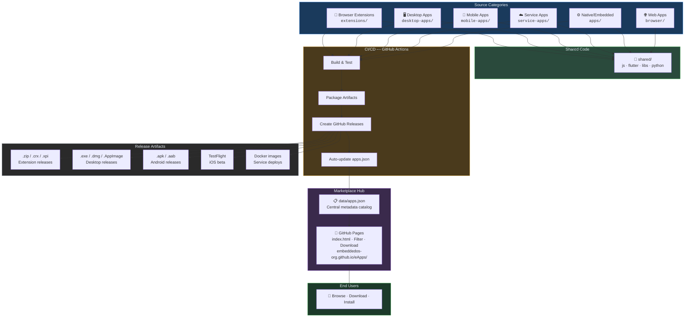

# EoS Marketplace Architecture

## Overview

**eApps** is the unified hub for the entire EoS ecosystem. It merges content from
[eOffice](https://github.com/embeddedos-org/eOffice),
[EoStudio](https://github.com/embeddedos-org/EoStudio),
[EoSim](https://github.com/embeddedos-org/EoSim),
[eServiceApps](https://github.com/embeddedos-org/eServiceApps), and
[eBrowser](https://github.com/embeddedos-org/eBrowser)
into a single repository with a beautiful app store served via GitHub Pages at
**[embeddedos-org.github.io/eApps](https://embeddedos-org.github.io/eApps/)**.

### Hosting Model

| Component | Hosted On |
|---|---|
| **App Store frontend** | GitHub Pages (`embeddedos-org.github.io/eApps/`) |
| **App catalog** | `data/apps.json` in this repo (auto-updated by CI) |
| **Binary releases** | GitHub Releases (`.exe` `.dmg` `.apk` `.zip` `.xpi` `.vsix` etc.) |
| **Auto-update manifests** | GitHub Pages (`updates/chrome-updates.xml`, `updates/firefox-updates.json`) |
| **Docker images** | Docker Hub (`embeddedos/eosim`) |
| **VS Code extension** | VS Code Marketplace (optional, via `VSCE_PAT` secret) |
| **iOS apps** | TestFlight (via `IOS_CERTIFICATE` secret) |

---

## Architecture Diagram



---

## Repository Structure

```
eApps/
├── index.html                    # Marketplace website (GitHub Pages entry)
├── css/marketplace.css           # Marketplace styles
├── js/marketplace.js             # Dynamic app grid from apps.json
├── data/
│   └── apps.json                 # Single source of truth for ALL listings
│
├── extensions/                   # Browser & editor extensions (from eOffice)
│   ├── browser/chrome/
│   ├── browser/firefox/
│   ├── safari/
│   ├── vscode/
│   ├── jetbrains/
│   ├── obsidian/
│   ├── slack/
│   ├── raycast/
│   ├── github/
│   ├── google-workspace/
│   └── office365/
│
├── desktop-apps/                 # Desktop applications
│   ├── eoffice/                  # Electron (from eOffice/desktop)
│   ├── eostudio/                 # Python/Tk (from EoStudio)
│   ├── eosim/                    # Python/QEMU simulator (from EoSim)
│   └── ebrowser/                 # C/SDL2 (from eBrowser)
│
├── mobile-apps/                  # Mobile applications
│   ├── eride/                    # Flutter (from eServiceApps)
│   ├── esocial/
│   ├── etrack/
│   ├── etravel/
│   └── ewallet/
│
├── service-apps/                 # Backend services
│   ├── backend/                  # Firebase backend (from eServiceApps)
│   └── eoffice-server/           # Node.js server (from eOffice)
│
├── shared/                       # Reusable code across platforms
│   ├── js/                       # JavaScript utilities
│   ├── flutter/                  # Dart packages
│   ├── libs/                     # C libraries
│   └── python/                   # Python packages
│
├── apps/                         # Native LVGL apps (original eApps)
│   ├── efiles/ echat/ emusic/ evideo/ ...
│   └── (40+ native apps)
│
├── core/                         # Native shared core (C)
├── cmake/                        # CMake toolchains
├── port/                         # Platform ports (SDL2, Android, iOS, Web, EoS)
├── tests/                        # Native app tests
│
├── .github/workflows/
│   ├── deploy-marketplace.yml    # Deploy marketplace to GitHub Pages
│   ├── release-app.yml           # Tag-based release with auto apps.json update
│   └── ci-native.yml             # CI for native C apps
│
└── docs/
    ├── architecture.md           # This file
    ├── adding-apps.md
    ├── platform-guide.md
    └── porting-guide.md
```

---

## Data Flow

1. **Developer pushes code** → relevant folder in `eApps` (or `shared/`)
2. **GitHub Actions** builds, tests, and packages automatically
3. **Artifacts** are uploaded to GitHub Releases (`.exe`, `.dmg`, `.apk`, `.zip`, etc.)
4. **`data/apps.json`** is auto-updated with the new version by CI
5. **GitHub Pages** re-deploys the marketplace with the latest catalog
6. **Users** visit `embeddedos-org.github.io/eApps/`, browse, filter, and download

---

## Merged Repositories

| Original Repo | Merged Into | Category |
|---|---|---|
| [eOffice](https://github.com/embeddedos-org/eOffice) | `extensions/`, `desktop-apps/eoffice/`, `service-apps/eoffice-server/` | Extensions, Desktop, Service, Web |
| [EoStudio](https://github.com/embeddedos-org/EoStudio) | `desktop-apps/eostudio/` | Desktop |
| [EoSim](https://github.com/embeddedos-org/EoSim) | `desktop-apps/eosim/` | Desktop, Simulator |
| [eServiceApps](https://github.com/embeddedos-org/eServiceApps) | `mobile-apps/`, `service-apps/backend/` | Mobile, Service |
| [eBrowser](https://github.com/embeddedos-org/eBrowser) | `desktop-apps/ebrowser/` | Desktop |
| eApps (original) | `apps/`, `core/`, `cmake/`, `port/` | Native/Embedded |

---

## Merge Commands

```bash
# Inside the eApps repo:

# Merge eServiceApps
git remote add eServiceApps https://github.com/embeddedos-org/eServiceApps.git
git fetch eServiceApps
git merge eServiceApps/main --allow-unrelated-histories --no-edit
# Reorganize files into service-apps/ and mobile-apps/

# Merge eOffice
git remote add eOffice https://github.com/embeddedos-org/eOffice.git
git fetch eOffice
git merge eOffice/main --allow-unrelated-histories --no-edit
# Reorganize into extensions/, desktop-apps/eoffice/, service-apps/eoffice-server/

# Merge EoStudio
git remote add EoStudio https://github.com/embeddedos-org/EoStudio.git
git fetch EoStudio
git merge EoStudio/main --allow-unrelated-histories --no-edit
# Move into desktop-apps/eostudio/

# Merge EoSim
git remote add EoSim https://github.com/embeddedos-org/EoSim.git
git fetch EoSim
git merge EoSim/main --allow-unrelated-histories --no-edit
# Move into desktop-apps/eosim/

# Merge eBrowser
git remote add eBrowser https://github.com/embeddedos-org/eBrowser.git
git fetch eBrowser
git merge eBrowser/main --allow-unrelated-histories --no-edit
# Move into desktop-apps/ebrowser/
```
